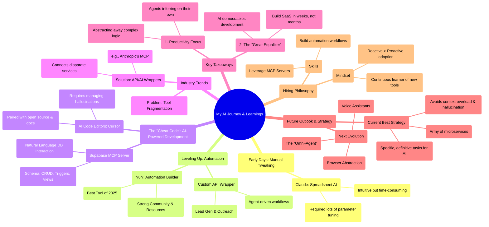

# My AI Journey: A Year of Learnings

You began your AI journey about a year ago with tools like Claude, quickly realizing that even user-friendly AI requires significant fine-tuning. This led you to develop a custom API to automate basic workflows, like lead generation and campaign creation.

A major breakthrough was discovering `N8N`, an automation workflow builder you'd recommend as the best tool of 2025, largely due to its strong community and ready-to-use resources. However, the ultimate productivity hack you found was leveraging an AI code editor like `Cursor`. You describe the combination of AI-powered coding, open-source code, and good documentation as a "cheat code." This enabled you to build a `Supabase MCP server`, allowing you to interact with your database using natural language for tasks like schema creation, data manipulation, and exploration.

You've observed the industry trend of wrapping APIs with AI protocols (like Anthropic's Model Context Protocol), making services accessible through natural language clients and solving the problem of tool fragmentation.

Your key takeaways are:
1.  **AI for Productivity:** Current AI adaptations are primarily focused on abstracting away complex logic and making our lives easier.
2.  **AI as the Great Equalizer:** AI coding editors are democratizing development, empowering individuals to become full-stack developers and build SaaS applications in weeks instead of months.

Based on this, you would hire someone who can build automation workflows, understands how to use MCP servers, and is committed to continuously learning about new AI tools, valuing a reactive approach to adoption over building from scratch.

Looking ahead, you predict the rise of voice assistants and the abstraction of the browser, eventually leading to a single "omni-agent." In the meantime, you believe the best strategy is to use an "army of microservices," assigning specific, well-defined tasks to AI models to minimize hallucination.

## Visualized Mind Map

