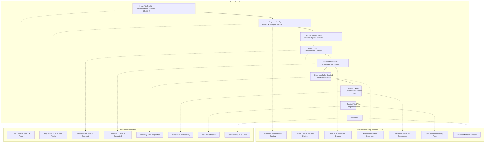

# Automwrite Sales Funnel: Known TAM Approach

This funnel diagram represents the sales process for Automwrite, accounting for the fact that we already know our total addressable market (all UK financial advisory firms registered with the FCA).

## Funnel Stage Details

### 1. Known TAM (Total Addressable Market)
- All UK financial advisory firms registered with the FCA
- Approximately 15,000+ potential firms
- Data already exists in Monday.com

### 2. Market Segmentation
- **Criteria:**
  - Firm size (number of advisers)
  - Report volume (estimated monthly output)
  - Current technology stack
  - Regulatory compliance burden
- **Go-to-Market Support:** Data enrichment via knowledge graph to profile firms

### 3. Priority Targets
- High-volume report producers
- Firms with identifiable inefficiencies (e.g., high paraplanner costs)
- Firms at technology transition points
- **Go-to-Market Support:** Predictive scoring to identify firms with highest potential ROI

### 4. Initial Contact
- Personalized outreach based on firm profile
- Value proposition aligned to specific firm challenges
- Multi-channel approach (email, LinkedIn, industry events)
- **Go-to-Market Support:** Automated personalization of outreach content

### 5. Qualified Prospects
- Confirmation of key pain points:
  - Time spent on reports (>1.5 hours per report)
  - Paraplanner costs (>£3,000/month)
  - Compliance challenges
  - Growth bottlenecks
- **Go-to-Market Support:** Pain point validation system with scoring

### 6. Discovery Calls
- Detailed needs assessment
- Service offering alignment
- Technical requirements review
- **Go-to-Market Support:** Knowledge graph integration for tailored questioning

### 7. Product Demos
- Customized to specific report types used by the firm
- Personalized with relevant example content
- Integration demonstration with current tools
- **Go-to-Market Support:** Auto-configured demo environments

### 8. Product Trial/Pilot
- Limited implementation (1-3 advisers)
- Specific report types testing
- Success metrics establishment
- **Go-to-Market Support:** Self-serve onboarding flow and monitoring

### 9. Customers
- Full implementation
- Ongoing success management
- Expansion opportunities
- **Go-to-Market Support:** Usage analytics and optimization suggestions

## Expected Funnel Metrics

Starting with a known TAM of 15,000+ firms, the funnel projects:
- **High Priority Segment:** 4,500 firms (30%)
- **Successfully Contacted:** 900 firms (20% of segment)
- **Qualified Prospects:** 225 firms (25% of contacted)
- **Discovery Calls:** 135 prospects (60% of qualified)
- **Product Demos:** 101 prospects (75% of discovery)
- **Trials/Pilots:** 40 companies (40% of demos)
- **Customers:** 32 companies (80% of trials)

## SDR Focus Areas

1. **Segment Validation**
   - Confirm segmentation criteria accuracy
   - Enrich firm profiles with industry knowledge

2. **Qualification Efficiency**
   - Rapidly identify genuine pain points
   - Filter for decision-making authority

3. **Discovery Call Quality**
   - Deep understanding of specific firm needs
   - Accurate documentation of technical requirements

4. **Demo-to-Trial Conversion**
   - Address objections effectively
   - Set clear expectations for trial outcomes

These areas represent the highest leverage points for SDR impact, supported by the go-to-market engineering system's data and insights. 