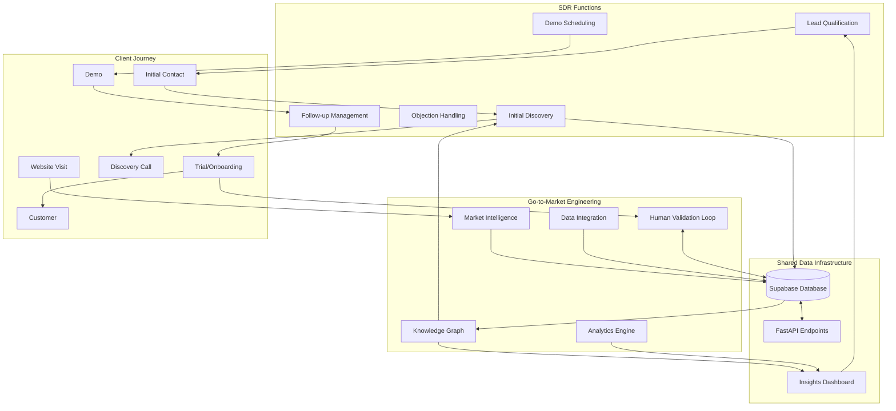

# Automwrite: SDR and Go-to-Market Integration

This document outlines how the Sales Development Representative (SDR) role can be structured to complement the go-to-market engineering system for Automwrite.

## Integrated Workflow Diagram

## SDR Role Structure

### Core Responsibilities

1. **Lead Qualification**
   - Leverage market intelligence from the go-to-market system
   - Prioritize adviser firms based on data-driven scoring
   - Qualify based on criteria: firm size, report volume, current workflow pain points

2. **Discovery Management**
   - Conduct initial discovery calls informed by knowledge graph insights
   - Document key pain points in structured format for system ingestion
   - Validate industry challenges from training guide with prospects

3. **Demo Coordination**
   - Schedule and prepare personalized demos with qualified prospects
   - Ensure demo examples align with prospect's specific report types
   - Coordinate with directors (Wes and Logan) for high-value opportunities

4. **Follow-up Optimization**
   - Use analytics engine to determine optimal follow-up timing
   - Leverage insights on prospect engagement and behavior patterns
   - Convert qualified prospects to the automated onboarding workflow

5. **Feedback Loop Participation**
   - Contribute to human validation loop for market intelligence
   - Provide qualitative insights to enhance the knowledge graph
   - Report objection patterns for continuous system improvement

## Integration Points with Go-to-Market Engineering

### Data Flow Integration

| SDR Activity | Engineering Support | Integration Method |
|--------------|---------------------|-------------------|
| Lead qualification | Firm prioritization scoring | API-driven lead scoring dashboard |
| Discovery calls | Pre-populated pain point checklist | Mobile data capture app w/ Supabase sync |
| Demo feedback | Pattern recognition in objections | Structured feedback forms |
| Follow-up tracking | Engagement prediction model | Automated next-action recommendations |
| Conversion data | Onboarding funnel analytics | Shared analytics dashboard |

### Technology Enablement for SDR

1. **Monday.com Enhancement**
   - Custom integrations with the Supabase database
   - Automated lead scoring visualization
   - Discovery call template with pre-populated market intelligence

2. **Mobile Data Capture**
   - Lightweight app for call notes and discovery information
   - Direct sync with knowledge graph entities
   - Voice-to-text capabilities mirroring product value proposition

3. **Personalized Demo Environment**
   - Pre-configured demo environments based on prospect profile
   - Auto-populated with relevant UK financial advice examples
   - Integration with common platforms (Transact, Quilter, etc.)

4. **Analytics Dashboard**
   - Sales pipeline visualization with prediction modeling
   - Engagement metrics across prospect journey
   - A/B testing capabilities for outreach messaging

## Implementation Roadmap

1. **Phase 1: Data Foundation** (Weeks 1-2)
   - Set up Supabase project and core schema
   - Establish API endpoints for Monday.com integration
   - Define entity taxonomy for UK financial advice market

2. **Phase 2: Tool Development** (Weeks 3-4)
   - Build SDR dashboard with lead prioritization
   - Develop discovery call template and data capture
   - Create initial knowledge graph visualization

3. **Phase 3: Process Integration** (Weeks 5-6)
   - Train SDR on data-augmented workflow
   - Implement feedback loops for continuous improvement
   - Establish metrics for measuring SDR efficiency gains

4. **Phase 4: Advanced Features** (Weeks 7-8)
   - Enable predictive analytics for follow-up optimization
   - Implement automated reporting on market coverage
   - Develop A/B testing framework for outreach techniques

## Key Performance Indicators

### SDR Efficiency Metrics
- Average qualification time per lead
- Discovery-to-demo conversion rate
- Data quality score for captured insights
- Follow-up efficiency (touches to conversion)

### Go-to-Market System Impact
- Market intelligence coverage percentage
- Knowledge graph entity growth rate
- Data-driven insight adoption by SDR
- Predictive model accuracy for prospect engagement

## Conclusion

By structuring the SDR role to complement the go-to-market engineering system, Automwrite can create a powerful feedback loop where human expertise enhances data quality while data-driven insights multiply human effectiveness. This integration aligns perfectly with Automwrite's value proposition of using technology to scale human capabilities in financial advice. 