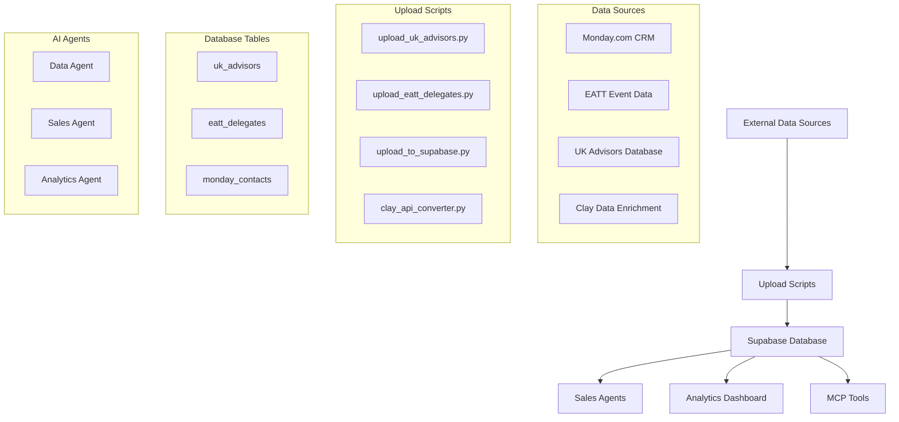

# Supabase Database Schema Documentation

This document outlines the database schema for the Automwrite Supabase instance, generated from analysis of upload scripts and codebase structure.

## Database Overview

- **Supabase URL**: https://xaezrqaiswdplflbalxa.supabase.co
- **Project**: Automwrite Sales & Marketing Data
- **Purpose**: Customer relationship management, lead tracking, and sales pipeline data
- **Authentication**: Bearer token authentication required for all API calls

## Tables

### uk_advisors

**Purpose**: Financial advisors and contact information from UK market
**Source**: UK Advisors CSV export data
**Upload Script**: `upload_uk_advisors.py`

#### Columns:
- `company_name` (text): Name of the advisory company
- `total_advisers` (integer): Total number of advisers at the company
- `website` (text): Company website URL
- `employee_count` (integer): Number of employees
- `size` (text): Company size classification
- `industry` (text): Industry sector
- `description` (text): Company description
- `domain` (text): Website domain
- `type` (text): Type of advisory firm
- `founded` (integer): Year company was founded
- `revenue` (text): Revenue information
- `site_traffic` (text): Website traffic metrics

#### Sample Data Structure:
```json
{
  "company_name": "Example Financial Advisory Ltd",
  "total_advisers": 25,
  "website": "https://example-advisory.co.uk",
  "employee_count": 45,
  "size": "Medium",
  "industry": "Financial Services",
  "description": "Independent financial advisory services",
  "domain": "example-advisory.co.uk",
  "type": "Independent",
  "founded": 2010,
  "revenue": "£5M-£10M",
  "site_traffic": "10K-50K monthly visits"
}
```

---

### eatt_delegates

**Purpose**: Delegate information from EATT events and conferences
**Source**: EATT Delegate Lite List Post Event data
**Upload Script**: `upload_eatt_delegates.py`

#### Columns:
- `company_name` (text): Name of the delegate's company

#### Sample Data Structure:
```json
{
  "company_name": "Example Technology Solutions Ltd"
}
```

**Note**: This table has a simplified structure focusing only on company names from EATT event attendees.

---

### monday_contacts

**Purpose**: Contact management data imported from Monday.com CRM
**Source**: Monday.com cold email boards export
**Upload Script**: `upload_to_supabase.py`

#### Columns:
- `source_file` (text): Original source file name
- `contact_group` (text): Contact categorization group
- `name` (text): Full name of the contact
- `email` (text): Primary email address
- `phone_number` (text): Primary phone number
- `website` (text): Associated website
- `company_name` (text): Company or organization name
- `status` (text): Contact status (e.g., lead, prospect, contacted)
- `first_name` (text): Contact's first name
- `last_name` (text): Contact's last name
- `address` (text): Physical address
- `location` (text): Geographic location
- `linkedin` (text): LinkedIn profile URL
- `notes` (text): Additional notes
- `extra_data` (json): Additional structured data stored as JSON

#### Sample Data Structure:
```json
{
  "source_file": "Cold_Email_Out_Reach_10-24_Adviser.xlsx",
  "contact_group": "UK Financial Advisers",
  "name": "John Smith",
  "email": "john.smith@example.com",
  "phone_number": "+44 20 1234 5678",
  "website": "https://example-company.co.uk",
  "company_name": "Example Financial Ltd",
  "status": "Qualified Lead",
  "first_name": "John",
  "last_name": "Smith",
  "address": "123 Main Street, London",
  "location": "London, UK",
  "linkedin": "https://linkedin.com/in/johnsmith",
  "notes": "Interested in automation solutions",
  "extra_data": "{\"lead_score\": 85, \"industry_segment\": \"wealth_management\"}"
}
```

---

## Data Flow Architecture



## API Usage

All tables are accessible via the Supabase REST API using PostgREST:

### Base URL Structure
```
GET {SUPABASE_URL}/rest/v1/{table_name}
```

### Authentication Headers
```http
apikey: {SUPABASE_KEY}
Authorization: Bearer {SUPABASE_KEY}
Content-Type: application/json
```

### Common Query Examples

#### Get all records from a table
```bash
curl -X GET "https://xaezrqaiswdplflbalxa.supabase.co/rest/v1/uk_advisors" \
  -H "apikey: {SUPABASE_KEY}" \
  -H "Authorization: Bearer {SUPABASE_KEY}"
```

#### Filter by company name
```bash
curl -X GET "https://xaezrqaiswdplflbalxa.supabase.co/rest/v1/monday_contacts?company_name=eq.Example%20Ltd" \
  -H "apikey: {SUPABASE_KEY}" \
  -H "Authorization: Bearer {SUPABASE_KEY}"
```

#### Get specific columns only
```bash
curl -X GET "https://xaezrqaiswdplflbalxa.supabase.co/rest/v1/uk_advisors?select=company_name,total_advisers,website" \
  -H "apikey: {SUPABASE_KEY}" \
  -H "Authorization: Bearer {SUPABASE_KEY}"
```

## MCP Integration

This database is designed to work with Model Context Protocol (MCP) tools for agent-based interactions.

### Available MCP Tools
Based on the environment analysis, the following MCP tools are available:
- **mcp**: Core MCP framework (v1.9.0)
- **mcp_neo4j_cypher**: Neo4j integration for graph queries (v0.2.1)

### Agent Access Patterns

#### Read Operations
- **Lead Queries**: Agents can search for prospects by company, industry, or location
- **Data Enrichment**: Cross-reference contacts across multiple tables
- **Analytics**: Aggregate data for sales metrics and pipeline analysis

#### Write Operations
- **Data Updates**: Update contact status and notes
- **New Records**: Insert new leads and prospects
- **Data Classification**: Tag and categorize contacts

#### Example Agent Queries
```python
# Search for financial advisors by company size
query = """
SELECT company_name, total_advisers, website 
FROM uk_advisors 
WHERE size = 'Large' 
AND total_advisers > 50
"""

# Find contacts from Monday.com with specific status
query = """
SELECT name, email, company_name, status 
FROM monday_contacts 
WHERE status LIKE '%Qualified%'
AND email IS NOT NULL
"""
```

## Data Quality and Validation

### Upload Process
- **Batch Processing**: Data uploaded in batches of 100 records to avoid rate limits
- **Data Cleaning**: Null values and empty strings are standardized
- **Error Handling**: Failed uploads are logged with detailed error messages

### Data Integrity
- **Duplicate Prevention**: Company names are used as natural keys where possible
- **Field Validation**: Required fields are enforced during upload
- **Type Consistency**: Data types are validated and converted appropriately

## Maintenance and Operations

### Regular Tasks
- **Data Refresh**: Upload scripts run periodically to sync with external sources
- **Schema Updates**: Coordinate with development team for structural changes
- **Performance Monitoring**: Track API usage and query performance

### Backup and Recovery
- **Automated Backups**: Handled by Supabase infrastructure
- **Point-in-Time Recovery**: Available through Supabase dashboard
- **Data Export**: Can export to CSV/JSON for external backup

### Security
- **API Key Management**: Rotate keys regularly
- **Access Control**: Row-level security policies can be implemented
- **Audit Logging**: Track data access and modifications

## Integration Scripts

### Current Upload Scripts
1. **upload_uk_advisors.py**: Processes UK financial advisor data
2. **upload_eatt_delegates.py**: Imports EATT event delegate information  
3. **upload_to_supabase.py**: Handles Monday.com CRM data import
4. **clay_api_converter.py**: Enriches contact data using Clay API

### Future Enhancements
- **Real-time Sync**: WebSocket connections for live data updates
- **Data Validation**: Enhanced schema validation and data quality checks
- **API Rate Limiting**: Implement client-side rate limiting for bulk operations

## Agent Usage Guidelines

### Best Practices for MCP Agents
1. **Query Optimization**: Use selective fields and filtering to minimize data transfer
2. **Batch Operations**: Group multiple operations to reduce API calls
3. **Error Handling**: Implement retry logic for transient failures
4. **Data Freshness**: Check timestamps before using cached data

### Common Use Cases
- **Lead Qualification**: Query multiple tables to build comprehensive prospect profiles
- **Sales Pipeline**: Track contact progression through sales stages
- **Market Analysis**: Aggregate data for industry and geographic insights
- **Contact Enrichment**: Cross-reference and enhance contact information

---

*Generated automatically from Supabase schema analysis*
*Last Updated: $(date)*
*MCP Tools Version: 1.9.0*